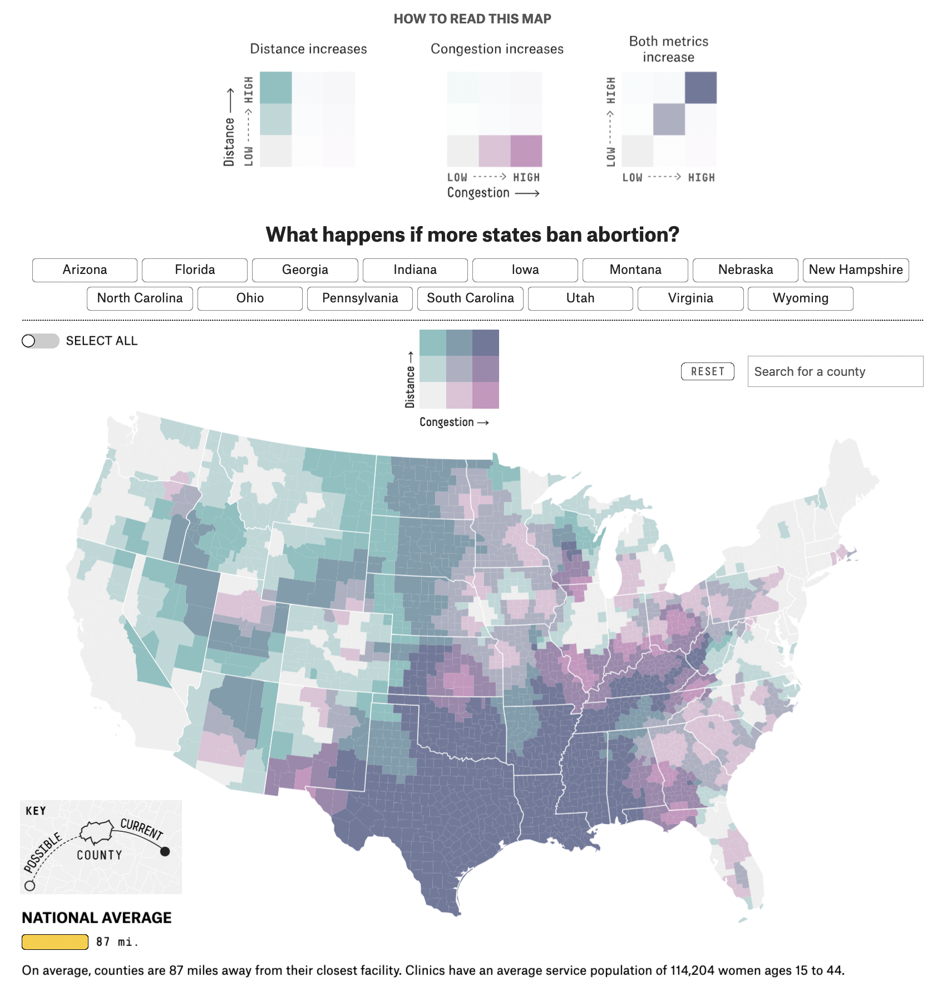
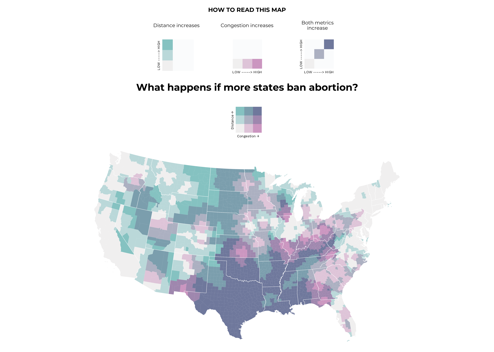
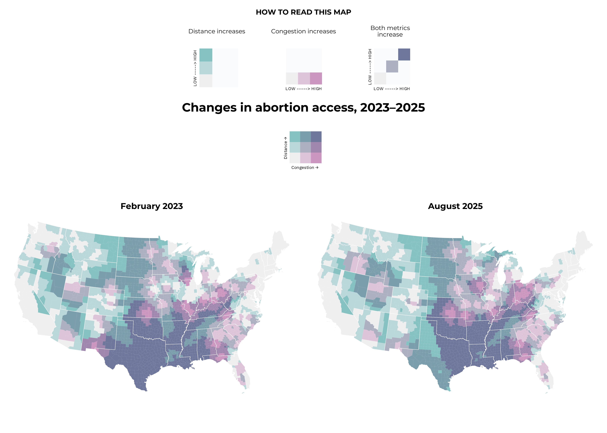
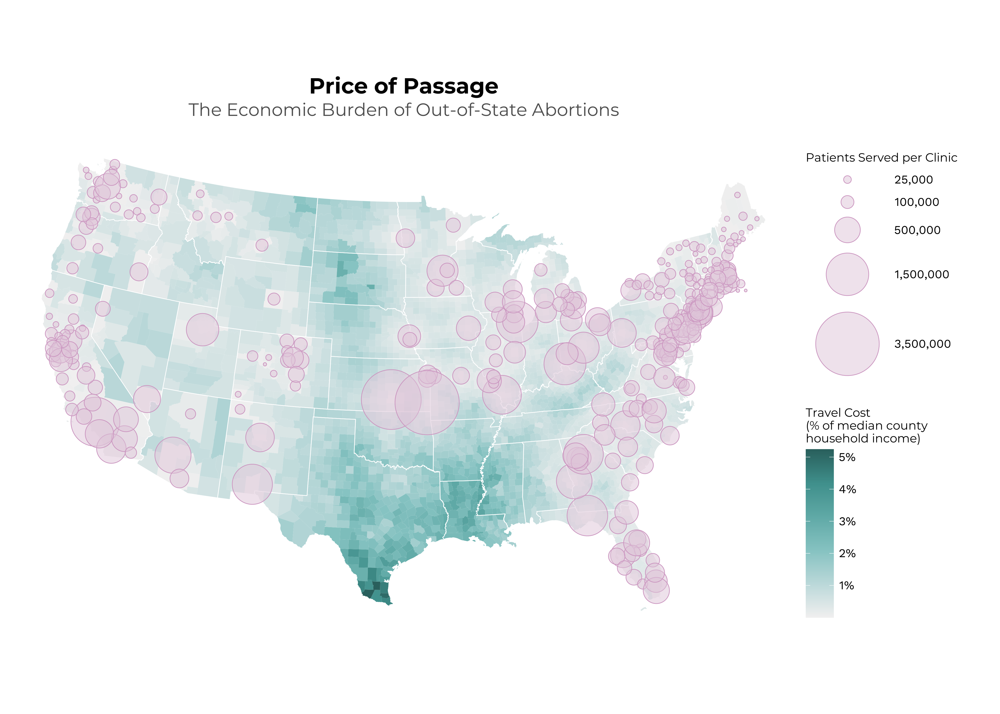

# Data Visualisation: Abortion Access in the USA

**Course:** Data Visualisation | MSc Computational Social Science at UC3M  
**Author:** Clare McGarvey  
**Published:** January 2026  
**Live project:** [csslab.uc3m.es/dataviz/projects/2025/100563749/](https://csslab.uc3m.es/dataviz/projects/2025/100563749/)

---

## Overview

This project maps abortion clinic access across the United States, tracking how access has changed since the Supreme Court overturned *Roe v. Wade* in June 2022. 
 
<div align="center">
  
  <p><em>Original Graph: What happens if more states ban abortion? by Aaron Bycoffe and Elena Mejía for FiveThirtyEight, March 2023</em></p>
</div>


The original article has been removed following Disney's takeover and shut down of FiveThirtyEight, but it can be viewed [here](https://web.archive.org/web/20230321155018/https://projects.fivethirtyeight.com/abortion-driving-distance/) via the Internet Archive.  

### 1. **Replication** 

A static reproduction of a bivariate choropleth map originally published by FiveThirtyEight (Bycoffe & Mejía, March 2023), showing abortion access as of February 2023.




### 2. **Then and Now**
An updated version of the map using the most recent available data (August 2025), placed side-by-side with the replication for direct comparison.




### 3. **Travel Cost Analysis**
An extended analysis replacing the distance metric with a relative travel cost measure, and a bubble map visualising clinic service areas alongside financial burden.



---

## Key Findings

- After bans in 14 states, the ripple effects were felt in neighbouring states, which saw sharp increases in clinic congestion as residents crossed state lines to access care.
- By August 2025, congestion had eased in West Texas (linked to new clinics in New Mexico, Colorado, and Wyoming) but worsened across Arkansas, Missouri, Iowa, Illinois, Indiana, and Ohio.
- Driving distances changed very little between 2023 and 2025, suggesting new clinics opened mainly in cities already served, doing little for rural counties.
- In some counties, a round trip to the nearest clinic now costs up to **5% of median monthly household income**.
- Access is heavily concentrated, with some individual clinics now serving up to **3.5 million people**. The closure of a small number of pivotal facilities could dramatically reshape the national access landscape.

---

## Data Sources

| Dataset | Source |
|---|---|
| Abortion access by county (Jan 2009–Aug 2025) | [Prof. Caitlin Myers, OSF](https://osf.io/qyh9w/overview) |
| US county & state shapefiles | [US Census Bureau via `tigris`](https://www.census.gov/geographies/mapping-files.html) |
| Regional gasoline prices (Aug 2025) | [US Energy Information Administration (EIA)](https://www.eia.gov/petroleum/gasdiesel/) |
| County-level median household income (2022) | [USDA Economic Research Service](https://www.ers.usda.gov/data-products/county-level-data-sets/county-level-data-sets-download-data) |

---

## Methods & Tools

Built in **R** using the following packages:

| Package | Purpose |
|---|---|
| `ggplot2` | Plotting |
| `sf` | Spatial data handling |
| `tigris` | US Census shapefiles |
| `biscale` | Bivariate choropleth mapping |
| `cowplot` | Arranging plots and legends |
| `tidyverse` | Data wrangling |
| `showtext` | Custom fonts |
| `readxl` | Reading fuel price data |

Maps use the **Conus Albers projection** (EPSG: 5070). Bivariate classification uses a **quantile** scheme (3×3 grid).

---

## Repository Structure

```
├── abortion_access_visualisation.Rmd   # Main analysis and write-up
├── data/
│   ├── 2025.07.01_abortionaccess_countyxmonth.csv   # Myers abortion access dataset
|   ├── Unemployment_Income2023.csv                  # Median income data
│   └── gasprices_region.xls                         # EIA fuel price data
├── figures/
│   ├── bubble_map.png
|   ├── final_comparison_plot.png
|   ├── final_plot_wlegend.png
│   └── original_graph.png
└── README.md
```

Caitlin Myers' abortion access dataset is too large to include in the repository but can be easily downloaded from [here](https://osf.io/qyh9w/overview).

---

## License

Text and figures are licensed under [Creative Commons Attribution CC BY 4.0](https://creativecommons.org/licenses/by/4.0/). Figures reused from other sources are noted in their captions.

---

## Citation

```
McGarvey, C. (2026, Jan. 16). Data Visualization | MSc CSS: Abortion Access in the USA.
Retrieved from https://csslab.uc3m.es/dataviz/projects/2025/100563749/
```

---

## References

Bycoffe, A., & Mejía, E. (2023, March 3). What happens if more states ban abortion? FiveThirtyEight. https://web.archive.org/web/20230321155018/https://projects.fivethirtyeight.com/abortion-driving-distance/

Myers, C. (2025). *County-by-month resident abortion counts, Vintage July 2025* [Dataset]. Open Science Framework. https://osf.io/qyh9w/overview

USDA Economic Research Service. (2023). County-level data sets: Unemployment and median household income [Dataset]. United States Department of Agriculture. https://www.ers.usda.gov/data-products/county-level-data-sets/

U.S. Energy Information Administration. (2025). Weekly retail gasoline and diesel prices [Dataset]. https://www.eia.gov/petroleum/gasdiesel/

U.S. Census Bureau. (2021). Connecticut planning regions as county-equivalents. https://www.census.gov/programs-surveys/geography/technical-documentation/
county-changes.html
